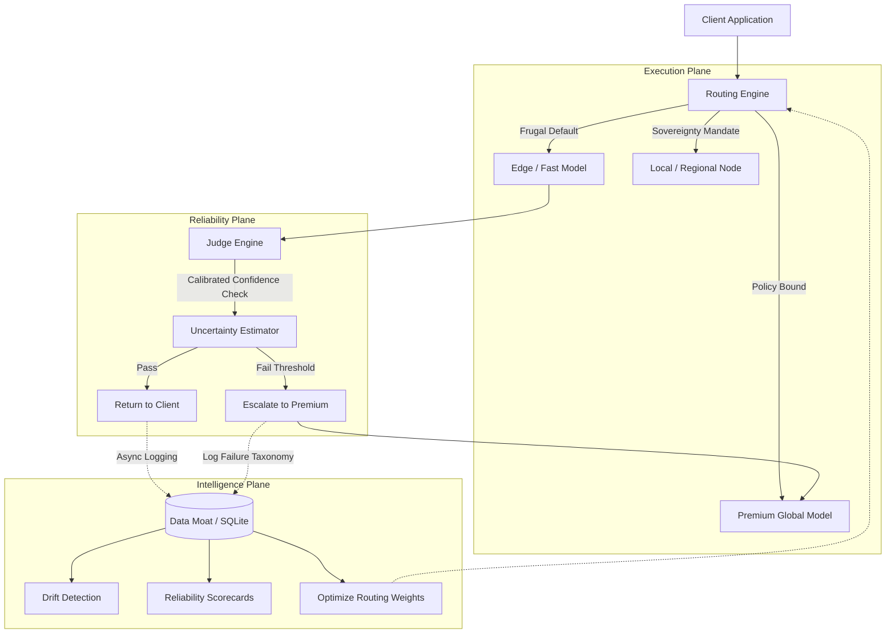

# OMI: Probabilistic AI Orchestration & Reliability Infrastructure

**OMI** is an open-source inference science engine. It is an orchestration, reliability, observability, and calibration layer designed to sit between your applications and probabilistic machine intelligence systems.

It is **not** a chatbot, wrapper, or simple proxy. OMI treats AI providers as volatile commodities and establishes an **Execution Plane**, a **Reliability Plane**, and an **Intelligence Plane** to guarantee measurable, statistically provable performance under real-world entropy.

---

## 🏗️ Core Architecture



---

## 🚀 Key Features

- **Reliability-Aware Routing**: Moves beyond simple cost heuristics to *Expected Utility Routing*, probabilistically avoiding models with historical escalation rates.
- **Sovereign Orchestration**: Prioritizes local, regional, or specific indic language nodes (e.g., Sarvam) natively when data residency or deep localization is required.
- **Hallucination & Failure Detection**: The internal Judge Engine classifies outputs against a strict failure taxonomy (Hallucination, Reasoning Failure, Malformed JSON) and traps errors before they reach the user.
- **Continuous Calibration Infrastructure**: Confidence is mathematically meaningless without calibration. OMI uses shadow inference to continuously align model confidence against ground-truth outcomes.
- **Drift Detection**: Automatic alerts when a provider's escalation rate spikes (e.g., "Gemini Flash hallucination rate increased 12%").
- **Chaos Resilience**: Designed to survive timeouts, truncated responses, and provider outages through resilient fallback chains.
- **Telemetry Intelligence**: Your telemetry becomes the moat. OMI tracks the economic *Value Generated* by quantifying cost avoided minus escalation overhead.

---

## 🛠️ Getting Started (Sandbox Validation)

OMI is currently in **Phase 3: Live Probabilistic Validation**. The sandbox is rate-limited to safely capture real-world entropy and human reliability feedback.

### Prerequisites
- Python 3.12+
- Keys for OpenAI, Anthropic, DeepSeek, Google, or Sarvam (You can use `USE_MOCK_PROVIDERS=True` to run entirely without keys for local chaos testing).

### Installation

```bash
git clone https://github.com/omichauhan-lgtm/omi-gateway.git
cd omi-gateway
pip install -r requirements.txt
```

### Running the Infrastructure

```bash
# Start the Sovereign Inference Engine
python -m uvicorn api.main:app --port 8000
```

### Submitting a Request

```bash
curl -X POST http://localhost:8000/generate \
-H "Content-Type: application/json" \
-d '{
  "prompt": "Translate the Article 21 of the Indian Constitution to Hindi.",
  "mode": "frugal",
  "policy": {
    "strict_mode": false,
    "sovereignty_required": true
  }
}'
```

---

## 📊 The Reliability Scorecard

OMI quantifies everything. You can query the true statistical state of your AI infrastructure:

```bash
curl -X GET http://localhost:8000/admin/scorecard -H "X-OMI-Admin-Key: <your-key>"
```

Returns:
- Judge Precision & Recall
- False Negative Rates
- Average Escalation Latency
- **Reliability Economics**: Total Cost Avoided & Value Generated.

---

## 🤝 Contributing

We welcome contributions to the measurement science core, sovereign routing, and calibration infrastructure. Please read [CONTRIBUTING.md](CONTRIBUTING.md) before submitting pull requests. All optimizations must be statistically validated via the `evals/regression_suite.py`.

## 🛡️ Security

Please refer to [SECURITY.md](SECURITY.md) for vulnerability disclosure and secret handling protocols.

## 📄 License

This project is licensed under the [Apache 2.0 License](LICENSE).
