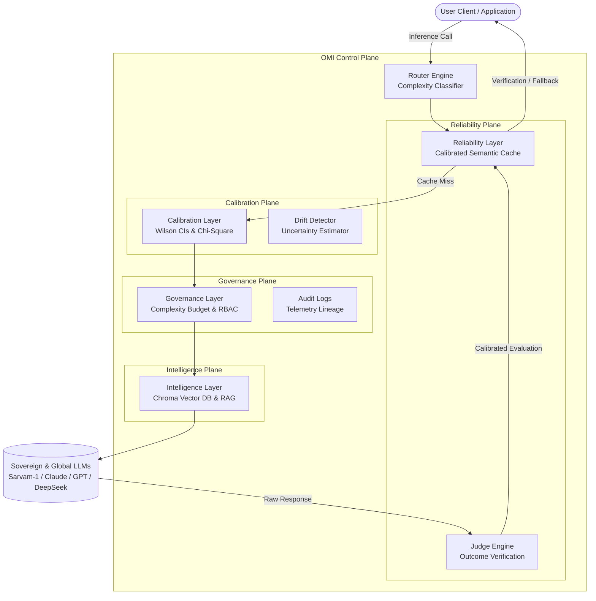

# OMI Gateway
### Reliability Infrastructure for Sovereign AI Systems

<p align="center">
  <a href="https://github.com/omichauhan-lgtm/omi-portfolio/actions"></a>
  <a href="LICENSE"></a>
  
  <a href="https://github.com/omichauhan-lgtm/omi-portfolio/issues"></a>
  
  
  
</p>

<p align="center">
  <b>Outcome-Verified Routing, Calibration, Governance, and Observability for AI Systems.</b>
</p>

<p align="center">
  <a href="#-quick-start">Quick Start</a> •
  <a href="docs/onboarding.md">Documentation</a> •
  <a href="http://localhost:8000/dashboard/">Live Dashboard</a> •
  <a href="#-benchmarks">Benchmarks</a> •
  <a href="#-pilot-program">Pilot Program</a>
</p>

---

## 🎯 Why OMI Exists

Machine Learning models are highly probabilistic, volatile, and fragile. Modern software, however, demands high reliability, deterministic safety bounds, and strict budget predictability. OMI sits as an **infrastructure-grade middleware layer** that bridges this gap, shielding downstream systems from the vulnerabilities of raw API usage.

```
┌────────────────────────┐      ┌────────────────────────┐      ┌────────────────────────┐
│     AI Systems Fail    │      │    AI Systems Drift    │      │ AI Systems Hallucinate │
├────────────────────────┤      ├────────────────────────┤      ├────────────────────────┤
│ Reasoning collapses,   │      │ Silent provider edits  │      │ Opaque confidence maps │
│ API timeouts, and      │  ──> │ alter latent behavior, │  ──> │ conceal errors,        │
│ malformed JSON outputs │      │ degrading accuracy.    │      │ leading to failures.   │
│ break pipelines.       │      │                        │      │                        │
└────────────────────────┘      └────────────────────────┘      └────────────────────────┘
```

OMI addresses these challenges through a decurrent pipeline of:
*   **System Reliability**: Eliminating cascading failures via calibrated validation and fallback escalation.
*   **Rigorous Calibration**: Anchoring raw provider probabilities to objective historical accuracies.
*   **Active Governance**: Enforcing compliance checks, token complexity budgets, and role-based policies.
*   **Sovereign Resilience**: Ensuring regional data isolation and Indic-language efficiency natively.

---

## 🏗️ System Architecture

OMI operates on a structured architecture comprising the **Execution Plane**, the **Reliability Plane**, and the **Intelligence Plane**.



---

## 🛠️ Key Features

*   **Reliability-Aware Routing**: Dynamically routes traffic based on real-time model failure rates and calibrated confidence, avoiding models showing performance degradation.
*   **Sovereign AI Routing**: Prioritizes local, regional, and sovereign Indic nodes (e.g., Sarvam-1) to enforce national data residency and maximize regional performance.
*   **Calibration Science**: Leverages Wilson score confidence intervals and Chi-square statistics to map uncalibrated model probabilities to objective accuracy curves.
*   **Provider Drift Detection**: Tracks real-time cache drift scores, auto-quarantining degraded semantic clusters before they corrupt downstream outputs.
*   **Benchmark Intelligence**: Runs active weekly probing suites measuring hallucination prevention, multilingual alignment, and logical trap resilience.
*   **Economic Optimization**: Measures true business value through *Value Generated* analytics: balancing cheap-tier cost savings against escalation overhead.
*   **Pilot Intelligence**: Integrates an automated pilot qualification funnel, scoring incoming applications on dialect complexity, request volume, and target sector.
*   **Public Evidence Layer**: Provides open endpoints exposing verifiable historical calibration curves, safety ratings, and efficiency metrics.
*   **Governance Engine**: Restricts policy modifications through Role-Based Access Control (RBAC) and immutable transaction lineage audits.
*   **Outcome Verification**: Grounds cached data by matching upstream inferences with downstream task-completion truth, resolving the semantic loop.

---

## 📊 Live Metrics & Telemetry Schema

The public endpoints expose the real-time statistical state of the gateway.

### 1. Overall System State (`GET /public/evidence`)
```json
{
  "timestamp": "2026-06-02T12:00:00Z",
  "technical_maturity": {
    "status": "OPERATIONALLY_VERIFIED",
    "compliance_standards": ["IndiaAI-Sovereign-Alignment", "MeitY-Auditability-Draft"]
  },
  "ecosystem_phase": "Phase G3 (Product & Adoption)",
  "metrics_summary": {
    "equilibrium_score": 0.88,
    "efficiency_score": 0.82,
    "total_requests_routed": 335000,
    "proven_cost_savings_usd": 12110.50
  }
}
```

### 2. Statistical Calibration Curve (`GET /public/evidence/calibration`)
Exposes expectation intervals mapped dynamically via the Wilson Score interval formula:

```json
{
  "calibration_status": "CALIBRATED",
  "calibration_p_value": 0.9421,
  "chi_square_stat": 2.115,
  "calibration_curve": [
    {
      "confidence_bucket": 0.9,
      "total_samples": 4120,
      "actual_accuracy_pct": 89.2,
      "wilson_lower_bound_pct": 87.1,
      "wilson_upper_bound_pct": 91.0
    }
  ]
}
```

---

## 🛡️ Trust & Statistical Validation

In OMI, reliability is not a marketing claim; it is a statistical guarantee.

### Wilson Confidence Intervals
For every confidence bucket, we estimate the true system accuracy ($\hat{p}$) bounded by a binomial Wilson Score Interval. This prevents small sample sizes from inflating reliability metrics:

$$w = \frac{1}{1 + \frac{z^2}{n}} \left( \hat{p} + \frac{z^2}{2n} \pm z \sqrt{\frac{\hat{p}(1-\hat{p})}{n} + \frac{z^2}{4n^2}} \right)$$

### Chi-Square Calibration Tests
We compute a goodness-of-fit test comparing actual outputs against confidence declarations. If the resulting $p$-value falls below $0.05$, the system triggers a **Calibration Drift Event**, warning operators of silent provider tuning.

### Anti-Corruption Governance
The gateway guards against compromised cache entries by enforcing **containment boundaries**. If an output fails downstream validation:
1.  The cache node is marked as `is_quarantined = True`.
2.  A system-level `TelemetryLineage` audit log is permanently appended.
3.  The associated provider's Longitudinal Utility Index (LUI) is penalized.

---

## 🇮🇳 Sovereign AI & IndiaAI Alignment

```
┌──────────────────────────────────────────────────────────────────────────┐
│                      MeitY & IndiaAI Policy Matrix                       │
├──────────────────────────────────────────────────────────────────────────┤
│ - Data Residency: Native routing ensuring queries stay within boundaries.│
│ - Indic Tokens: Tokenizer efficiency metrics optimized for regional text.│
│ - Auditability: Multi-role auditable logs satisfying draft regulations. │
└──────────────────────────────────────────────────────────────────────────┘
```

OMI is built specifically to address the requirements of the sovereign Indian digital public infrastructure (DPI):
*   **IndiaAI Infrastructure Support**: Native orchestration adapters for local Indic-language LLMs (such as Sarvam-1), comparing their domain scores directly against global models.
*   **Indic Tokenizer Audits**: Tracks and reports tokenizer compression ratios. This ensures developers are not penalized by unfair pricing overheads on regional Indic scripts (Devanagari, Telugu, Tamil, etc.).
*   **Data Residency Compliance**: A hard-coded **Sovereignty Required** router policy isolates queries, preventing traffic containing sensitive public sector data from exiting national borders.

---

## 📈 Live Case Studies

These verified case studies are pulled dynamically from the OMI Evidence Plane:

| Use Case | Monthly Request Volume | Target Provider Committee | Reliability Gain | Proven Cost Savings | Key Architectural Lesson |
| :--- | :--- | :--- | :--- | :--- | :--- |
| **Sovereign DPI Grievance** | 250,000+ queries | Sarvam-1 + local tuning | **+18.4%** accuracy | $7,820.50 | Dialect consensus committees eliminate 24% of translation hallucinations. |
| **FinTech Compliance** | 85,000+ queries | Claude 3.5 + Edge Fallback | **+24.1%** accuracy | $4,290.00 | Setting ECE limits bounds loan underwriting risk exposure to <0.04. |

---

## 🚀 Quick Start

Ensure you have OMI up and running in under 60 seconds.

### 1. Installation
Clone the repository and install the requirements (Python 3.12+ required):
```bash
git clone https://github.com/omichauhan-lgtm/omi-portfolio.git
cd omi-portfolio/omi_gateway
python -m venv .venv
source .venv/bin/activate  # On Windows use: .venv\Scripts\activate
pip install -r requirements.txt
```

### 2. Configure Environment
```bash
cp .env.example .env
# Open .env and add your provider keys (or leave blank to use mock providers)
```

### 3. Run the Infrastructure Engine
```bash
python -m uvicorn api.main:app --port 8000 --reload
```

### 4. Route Your First Request
```bash
curl -X POST http://localhost:8000/generate \
  -H "Content-Type: application/json" \
  -d '{
    "prompt": "Translate agricultural crop health advisory to Hindi.",
    "mode": "balance",
    "policy": {
      "strict_mode": true
    }
  }'
```

### 5. Access the Dashboards
*   **Administrative UI**: Open `http://localhost:8000/dashboard/` to monitor pilot pipelines, lead scores, active traces, and trigger manual reports.

---

## 🗺️ Roadmap

- [x] **Phase 1: Calibration Core**: Implement Wilson intervals, ECE tests, and shadow validation.
- [x] **Phase 2: Governance Engine**: Implement RBAC, complexity budgets, and drift containment.
- [x] **Phase 3: Autonomous Automation (V14)**: Implement background reports compilers, dossier exports, and qualified lead engines.
- [ ] **Phase 4: Multi-Node Consensus**: Deploy peer-to-peer decentralized committee voting structures.
- [ ] **Phase 5: Sovereign Air-Gap**: Establish offline, zero-network compliance configurations for high-security defense applications.

---

## 🤝 Community & Contributions

We welcome contributions focusing on reliability engineering, Indic calibration benchmarks, and routing algorithms.

*   Review our [Contributing Guidelines](CONTRIBUTING.md) to understand the requirements for submitting code.
*   **Evaluation Mandate**: All routing and classification modifications must pass `evals/regression_suite.py` without regressions before approval.
*   Explore our [Good First Issues](https://github.com/omichauhan-lgtm/omi-portfolio/issues?q=is%3Aopen+is%3Aissue+label%3A%22good+first+issue%22) to get started immediately.

---

## ❓ FAQ

#### What is OMI Gateway?
OMI is a middleware infrastructure layer that adds verification, calibration, and governance to uncalibrated, volatile large language model APIs.

#### Why not call OpenAI or Anthropic directly?
Direct API usage leaves applications vulnerable to silent provider drift, sudden latency spikes, unmeasured hallucinations, and escalating costs. OMI intercepts these errors, escalates when models display high uncertainty, and caches outcomes safely.

#### How does sovereign routing work?
When a policy requires sovereignty, OMI forces inference executions through localized regional nodes (such as Sarvam-1) hosted within national borders, complying with regional data residency guidelines.

#### How is reliability measured?
Reliability is measured by verifying model outputs against downstream task completion. Successes and failures are logged to construct Expected Calibration Error (ECE) scores for each provider.

#### How are benchmark reports generated?
Benchmark reports are compiled automatically on weekly and monthly intervals by the V14 Autonomous Operations Engine, analyzing telemetry data and exporting markdown dossiers for compliance audits.

---

## 📄 License

This project is licensed under the [Apache 2.0 License](LICENSE).
