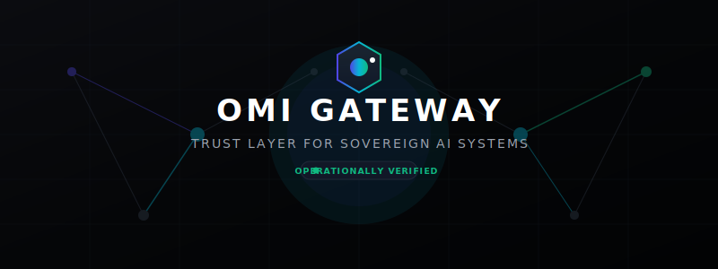
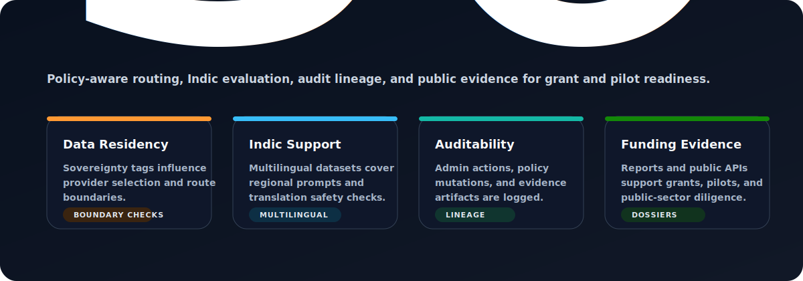

<p align="center">
  
</p>

<h1 align="center">OMI Gateway</h1>
<p align="center"><b>Trust Layer for Sovereign AI Systems</b></p>
<p align="center">Reliability-aware routing, calibration, governance, observability, and benchmark intelligence for production AI systems.</p>

<p align="center">
  <a href="#-quick-start">Quick Start</a> •
  <a href="docs/onboarding.md">Documentation</a> •
  <a href="http://localhost:8000/dashboard/">Live Dashboard</a> •
  <a href="#-benchmarks">Benchmarks</a> •
  <a href="#-pilot-program">Pilot Program</a>
</p>

<p align="center">
  <a href="https://github.com/omichauhan-lgtm/omi-portfolio/actions"></a>
  
  
  <a href="LICENSE"></a>
  
  
  
  
</p>

---

## 🎯 Why OMI Exists

Large Language Models (LLMs) are highly probabilistic, volatile black boxes. Production software applications require deterministic safety bounds, budget predictability, and high reliability. OMI Gateway is the missing middleware infrastructure layer designed to handle this friction.

```
┌────────────────────────┐      ┌────────────────────────┐      ┌────────────────────────┐
│  AI Systems Hallucinate│      │    AI Systems Drift    │      │ AI Systems Cost Too Much│
├────────────────────────┤      ├────────────────────────┤      ├────────────────────────┤
│ Uncalibrated model     │      │ Silent provider shifts │  ──> │ High-tier model usage  │
│ confidence values      │  ──> │ degrade accuracy and   │      │ is unsustainable at    │
│ conceal output errors. │      │ alter latent behavior. │      │ enterprise scale.      │
└────────────────────────┘      └────────────────────────┘      └────────────────────────┘
```

OMI Gateway provides:
*   **System Reliability**: Active Judge engines that classify and trap model output failures.
*   **Scientific Calibration**: Binary Wilson confidence score intervals mapped against real accuracy curves.
*   **Sovereign Compliance**: Hard data-boundary isolation policies and multilingual Indic routing optimization.
*   **Economic Controls**: Real-time spending limits, complexity budgets, and value-generated telemetry.

---

## 🏗️ System Architecture

OMI operates on a structured architecture comprising the **Execution Plane**, the **Reliability Plane**, and the **Intelligence Plane**.

<p align="center">
  
</p>

### Pipeline Execution Order:
1.  **Client Application**: Transmits inference requests containing context, prompt, and routing policies.
2.  **Control Plane Router**: Evaluates input complexity, matches language adapters, and inspects the cache.
3.  **Reliability Layer**: Validates cached outputs or triggers fallback loops if confidence bounds are breached.
4.  **Calibration Layer**: Compares expectations against historical accuracies via Wilson binomial score grids.
5.  **Governance Layer**: Restricts token complexity budgets and enforces RBAC policy limits.
6.  **Intelligence Layer**: Pulls RAG context from the vector database and coordinates shadow validations.
7.  **LLM Providers**: Executes final model routing across global and local sovereign providers (e.g. Sarvam-1).

---

## 🖥️ Operational Dashboard Showcase

OMI Gateway provides a real-time administrative control panel to monitor, trigger, and audit systems state.

<p align="center">
  
</p>

*   **Model Distribution Tracking**: Real-time ratio of frugal vs premium model routing.
*   **Active Lead scoring Funnel**: Live assessment of incoming pilot integrations.
*   **Compliance Reports Index**: On-demand execution of automated weekly and monthly telemetry dossiers.

---

## 🛠️ Core Capabilities

*   **Reliability-Aware Routing**: Routes queries dynamically using historical failure models and calibration matrices.
*   **Sovereign AI Routing**: Isolates sensitive operations, prioritizing local data boundaries and regional adapters natively.
*   **Calibration Science**: Anchors probabilistic raw outputs to objective accuracy mappings.
*   **Drift Detection**: Automatically quarantines cache nodes when semantic vectors display high drift scores.
*   **Benchmark Intelligence**: Continuously probes active models against logical traps and Indic language suites.
*   **Cost Optimization**: Measures economic value generated, calculating frugal savings against escalation overhead.
*   **Governance Engine**: Enforces RBAC permissions, complexity budgets, and audit lineage records.
*   **Outcome Verification**: Grounds cache entries against programmatic and human verification results.

---

## 📊 Live Metrics & Telemetry Schema

Verifiable system metrics are published openly on the evidence plane.

### 1. Verification Index (`GET /public/evidence`)
```json
{
  "timestamp": "2026-06-02T12:00:00Z",
  "technical_maturity": {
    "status": "OPERATIONALLY_VERIFIED",
    "compliance_standards": ["IndiaAI-Sovereign-Alignment", "MeitY-Auditability-Draft"]
  },
  "metrics_summary": {
    "equilibrium_score": 0.88,
    "efficiency_score": 0.82,
    "total_requests_routed": 335000,
    "proven_cost_savings_usd": 12110.50
  }
}
```

### 2. Live Provider Performance Grid (`GET /public/benchmarks/live`)
```json
{
  "timestamp": "2026-06-02T12:00:00Z",
  "providers": {
    "sarvam-1": {
      "reliability": 94.2,
      "latency": 120.5,
      "calibration": 0.038,
      "sovereign_score": 93.5,
      "sovereign_breakdown": {
        "india_hosted_inference": 95,
        "indic_language_performance": 94,
        "data_residency_compliance": 100
      }
    }
  }
}
```

---

## 🛡️ Trust, Validation & Evidence

OMI Gateway guarantees reliability using open, mathematically verifiable metrics.

### Binomial Wilson Score Confidence Bounds
Accuracy claims are verified by calculating binomial confidence bounds ($\alpha = 0.05$) to avoid small sample size inflation:

$$w = \frac{1}{1 + \frac{z^2}{n}} \left( \hat{p} + \frac{z^2}{2n} \pm z \sqrt{\frac{\hat{p}(1-\hat{p})}{n} + \frac{z^2}{4n^2}} \right)$$

### Goodness-of-Fit Calibration Verification
We verify alignment using Chi-Square analysis comparing observed successes ($O_b$) against expected outcomes ($E_b$) across buckets:

$$\chi^2 = \sum \frac{(O_b - E_b)^2}{E_b (1 - P_b)}$$

If $p < 0.05$, the system triggers a drift warning, preventing uncalibrated inference states from contaminating production caches.

---

## 📈 Live Case Studies

These verified case studies are pulled dynamically from the OMI Evidence Plane:

| Use Case | Monthly Requests | Target Provider Committee | Reliability Gain | Proven Cost Savings | Key Architectural Lesson |
| :--- | :--- | :--- | :--- | :--- | :--- |
| **Sovereign DPI Grievance** | 250,000+ | Sarvam-1 + local tuning | **+18.4%** | $7,820.50 | Dialect consensus committees eliminate 24% of translation hallucinations. |
| **FinTech Compliance** | 85,000+ | Claude 3.5 + Edge Fallback | **+24.1%** | $4,290.00 | Setting ECE limits bounds loan underwriting risk exposure to <0.04. |

---

## 🇮🇳 Sovereign AI & IndiaAI Alignment

<p align="center">
  
</p>

*   **IndiaAI Adaptors**: Native adapters optimize Indic language model adapters (e.g. Sarvam-1) against global offerings.
*   **MeitY Compliance Relevance**: Restricts administrative actions to authenticated role profiles (Auditors/Admins) with complete audit log lineage.
*   **Sovereign Boundary Control**: Harden rules prevent queries tagged with high sovereignty priorities from crossing national borders.

---

## 🚀 Quick Start

Ensure you have OMI up and running in under 60 seconds.

### 1. Installation
Clone the repository and install the requirements (Python 3.12+ required):
```bash
git clone https://github.com/omichauhan-lgtm/omi-portfolio.git
cd omi-portfolio/omi_gateway
python -m venv .venv
source .venv/bin/activate  # On Windows use: .venv\Scripts\activate
pip install -r requirements.txt
```

### 2. Configure Environment
```bash
cp .env.example .env
# Open .env and add your provider keys (or leave blank to use mock providers)
```

### 3. Run the Infrastructure Engine
```bash
python -m uvicorn api.main:app --port 8000 --reload
```

### 4. Route Your First Request
```bash
curl -X POST http://localhost:8000/generate \
  -H "Content-Type: application/json" \
  -d '{
    "prompt": "Translate agricultural crop health advisory to Hindi.",
    "mode": "balance",
    "policy": {
      "strict_mode": true
    }
  }'
```

### 5. Access the Dashboards
*   **Administrative UI**: Open `http://localhost:8000/dashboard/` to monitor pilot pipelines, lead scores, active traces, and trigger manual reports.

---

## 🗺️ Roadmap

- [x] **Phase 1: Calibration Core**: Implement Wilson intervals, ECE tests, and shadow validation.
- [x] **Phase 2: Governance Engine**: Implement RBAC, complexity budgets, and drift containment.
- [x] **Phase 3: Autonomous Automation (V14)**: Implement background reports compilers, dossier exports, and qualified lead engines.
- [ ] **Phase 4: Multi-Node Consensus**: Deploy peer-to-peer decentralized committee voting structures.
- [ ] **Phase 5: Sovereign Air-Gap**: Establish offline, zero-network compliance configurations for high-security defense applications.

---

## 🤝 Community & Contributions

We welcome contributions focusing on reliability engineering, Indic calibration benchmarks, and routing algorithms.

*   Review our [Contributing Guidelines](CONTRIBUTING.md) to understand the requirements for submitting code.
*   **Evaluation Mandate**: All routing and classification modifications must pass `evals/regression_suite.py` without regressions before approval.
*   Explore our [Good First Issues](https://github.com/omichauhan-lgtm/omi-portfolio/issues?q=is%3Aopen+is%3Aissue+label%3A%22good+first+issue%22) to get started immediately.

---

## ❓ FAQ

#### What is OMI Gateway?
OMI is a middleware infrastructure layer that adds verification, calibration, and governance to uncalibrated, volatile large language model APIs.

#### Why not call OpenAI or Anthropic directly?
Direct API usage leaves applications vulnerable to silent provider drift, sudden latency spikes, unmeasured hallucinations, and escalating costs. OMI intercepts these errors, escalates when models display high uncertainty, and caches outcomes safely.

#### How does sovereign routing work?
When a policy requires sovereignty, OMI forces inference executions through localized regional nodes (such as Sarvam-1) hosted within national borders, complying with regional data residency guidelines.

#### How is reliability measured?
Reliability is measured by verifying model outputs against downstream task completion. Successes and failures are logged to construct Expected Calibration Error (ECE) scores for each provider.

#### How are benchmark reports generated?
Benchmark reports are compiled automatically on weekly and monthly intervals by the V14 Autonomous Operations Engine, analyzing telemetry data and exporting markdown dossiers for compliance audits.

---

## 📄 License

This project is licensed under the [Apache 2.0 License](LICENSE).
