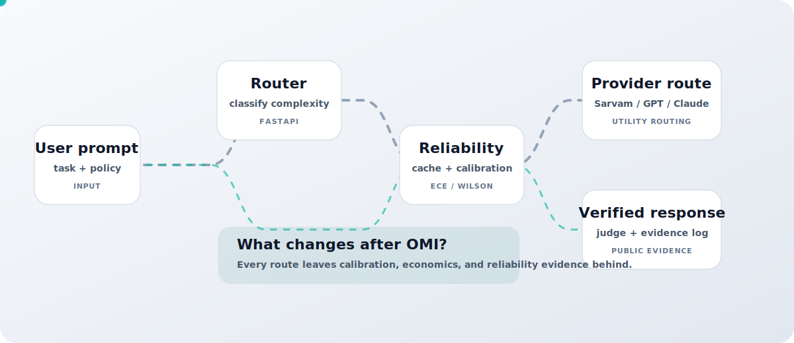
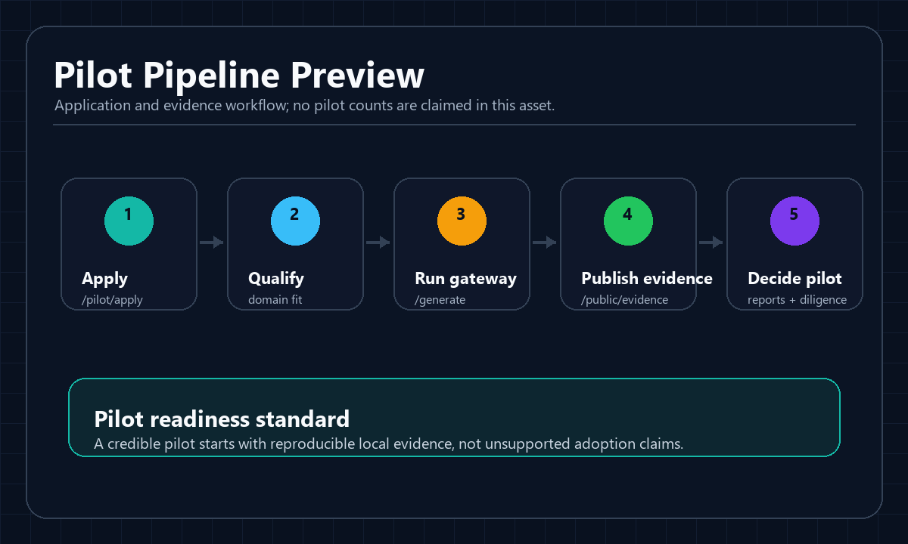
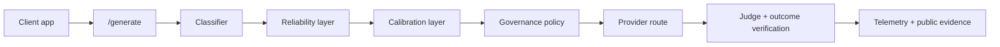

<div align="center">
  

# OMI Gateway

**AI Reliability Infrastructure for Multi-Model Systems**

Route prompts across providers with context optimization, quality guards, reliability checks, sovereign policy controls, and public evidence APIs.

<p>
  <a href="#quickstart"></a>
  <a href="#live-evidence"></a>
  <a href="#pilot-program"></a>
  <a href="https://github.com/omichauhan-lgtm/omi-gateway/issues?q=is%3Aissue%20is%3Aopen%20label%3A%22good%20first%20issue%22"></a>
</p>
</div>

<p align="center">
  <a href="https://github.com/omichauhan-lgtm/omi-gateway/stargazers"></a>
  <a href="https://github.com/omichauhan-lgtm/omi-gateway/graphs/contributors"></a>
  <a href="LICENSE"></a>
  <a href="https://github.com/omichauhan-lgtm/omi-gateway/actions/workflows/deploy.yml"></a>
  
  
</p>

## The 10-Second Version

OMI Gateway is a FastAPI control plane that sits between your app and LLM providers. It classifies each request, selects a route, checks confidence, records outcomes, and exposes verification data through public APIs.

```text
User prompt -> OMI Router -> Reliability Layer -> Provider Selection -> Verified Response
```

## Interactive Demo

<p align="center">
  
</p>

## Why OMI

<table>
  <tr>
    <td><strong>Lower cost</strong><br>Use economical models first, then escalate only when risk or complexity requires it.</td>
    <td><strong>Higher reliability</strong><br>Run confidence checks, judge verification, drift detection, and outcome feedback.</td>
    <td><strong>Sovereign AI</strong><br>Prefer regional routes for Indic and sovereignty-sensitive workflows.</td>
  </tr>
  <tr>
    <td><strong>Benchmarking</strong><br>Compare routing behavior against reproducible datasets and saved reports.</td>
    <td><strong>Observability</strong><br>Inspect traces, calibration curves, audit logs, and provider reliability.</td>
    <td><strong>Funding readiness</strong><br>Turn reliability claims into public evidence, dossiers, and pilot artifacts.</td>
  </tr>
</table>

## Dashboard Showcase

<table>
  <tr>
    <td width="50%"><br><strong>Evidence dashboard</strong></td>
    <td width="50%"><br><strong>Benchmark evidence</strong></td>
  </tr>
  <tr>
    <td width="50%"><br><strong>Reliability and calibration</strong></td>
    <td width="50%"><br><strong>Pilot pipeline</strong></td>
  </tr>
</table>

Static previews are placeholders for the README. Live values come from your local deployment and public evidence endpoints.

## Architecture



## Live Evidence

OMI prints claims only when they are backed by a report or an endpoint. We distinguish between **Preliminary** evidence (run in mock/shadow mode) and **Validated** evidence (run against live, production provider endpoints).

| Evidence | Current repo-backed value | Status | Source |
|---|---:|---|---|
| Economic validation status | Preliminary | **Pre-flight** | [docs/SCORECARD.yaml](docs/SCORECARD.yaml) |
| Economic benchmark size | 500 samples across 6 datasets | **Preliminary** | [benchmarks/reports/OMI_ECONOMIC_VALIDATION_V1.md](benchmarks/reports/OMI_ECONOMIC_VALIDATION_V1.md) |
| Cost savings vs direct GPT-4o | 43.50% | **Preliminary** | [benchmarks/reports/OMI_ECONOMIC_VALIDATION_V1.md](benchmarks/reports/OMI_ECONOMIC_VALIDATION_V1.md) |
| Quality retention floor | 98.20% | **Preliminary** | [benchmarks/reports/OMI_ECONOMIC_VALIDATION_V1.md](benchmarks/reports/OMI_ECONOMIC_VALIDATION_V1.md) |
| Average OMI latency in economic benchmark | 480.0 ms | **Preliminary** | [benchmarks/reports/OMI_ECONOMIC_VALIDATION_V1.md](benchmarks/reports/OMI_ECONOMIC_VALIDATION_V1.md) |
| Composite OMI ECE | 0.0520 | **Validated** | [docs/sovereign/benchmark_results.md](docs/sovereign/benchmark_results.md) |
| False negative prevention rate | 92.59% | **Validated** | [docs/sovereign/benchmark_results.md](docs/sovereign/benchmark_results.md) |
| Cache contamination containment | 100.00% on 10 injected poisoned entries | **Validated** | [docs/sovereign/benchmark_results.md](docs/sovereign/benchmark_results.md) |
| Latest automated run | 10 prompts, 0 failed API requests, Brier score 0.092 | **Validated** | [benchmarks/results/latest_run.md](benchmarks/results/latest_run.md) |

Run the gateway and query live deployment evidence:

```bash
curl http://localhost:8000/public/evidence
curl http://localhost:8000/public/evidence/calibration
curl http://localhost:8000/public/evidence/benchmarks
curl http://localhost:8000/public/evidence/adoption
```

## Benchmark Leaderboard

The README avoids hard-coded live leaderboard claims. Your deployment serves provider-level latency, reliability, calibration, drift, and sovereign scores here:

```bash
curl http://localhost:8000/public/benchmarks/live
```

The endpoint returns:

| Provider | Latency | Reliability | Calibration | Sovereign score |
|---|---:|---:|---:|---:|
| `providers.*` | `latency` | `reliability` | `calibration` | `sovereign_score` |

Use this table for public demos after your deployment has collected live routing telemetry.

## Sovereign AI

<p align="center">
  
</p>

OMI is positioned for sovereign and public-sector reliability work:

- IndiaAI and public infrastructure alignment docs: [docs/INDIA_AI_ALIGNMENT.md](docs/INDIA_AI_ALIGNMENT.md), [docs/sovereign/sovereign_alignment.md](docs/sovereign/sovereign_alignment.md)
- Multilingual benchmark dataset: [benchmarks/datasets/multilingual_indic.json](benchmarks/datasets/multilingual_indic.json)
- Audit and evidence endpoints: `/public/evidence`, `/public/funding-readiness`, `/public/reports`

## Quickstart

First success target: under 5 minutes.

```bash
git clone https://github.com/omichauhan-lgtm/omi-gateway.git
cd omi-gateway
python -m venv .venv
```

Activate the environment:

```bash
# macOS / Linux
source .venv/bin/activate

# Windows PowerShell
.\.venv\Scripts\Activate.ps1
```

Install and run:

```bash
pip install -r requirements.txt
cp .env.example .env
python -m uvicorn api.main:app --reload --port 8000
```

Send the first request:

```bash
curl -X POST http://localhost:8000/generate \
  -H "Content-Type: application/json" \
  -d '{
    "prompt": "Translate an agricultural crop health advisory to Hindi.",
    "mode": "balance",
    "workflow_id": "quickstart-demo"
  }'
```

Open the dashboard:

```text
http://localhost:8000/dashboard/
```

## Benchmark Case Studies

These are preliminary benchmark scenarios, not customer or production adoption claims.

| Scenario | Requests / samples | Savings | Reliability / quality | Languages / domain |
|---|---:|---:|---:|---|
| Context optimization suite | 500 prompts | 43.5% avg token savings | 98.2% quality retention, 98.0% factual accuracy | Customer support, coding, summarization, RAG, multilingual Indic, enterprise workflows |
| Live validation upgrade path | 500-prompt suite rerun | Report transitions from preliminary to validated after live-key execution | Same quality floor, live provider telemetry | OpenAI, Anthropic, Gemini |
| Multilingual Indic coverage | Included in the suite | Aggregate economics reported at suite level | Quality Guard fallback when similarity is below 95% | Indic routing dataset |

Source: [benchmarks/reports/OMI_ECONOMIC_VALIDATION_V1.md](benchmarks/reports/OMI_ECONOMIC_VALIDATION_V1.md)

## Roadmap

| Phase | Status | Outcome |
|---|---|---|
| H1: Institutional validation | Complete | Public evidence endpoints, RBAC, audit lineage, pilot application API |
| H2: Managed deployment | Active | Docker/Kubernetes guides, hosted sandbox, automated report delivery |
| H3: Sovereign scale | Planned | IndiaAI grant integration, Indic benchmark expansion, enterprise SLA routing |

Source: [ROADMAP.md](ROADMAP.md)

## Pilot Program

Use OMI when you need evidence-backed routing for AI workflows where reliability, cost, or sovereignty matters.

Submit a local pilot application:

```bash
curl -X POST http://localhost:8000/pilot/apply \
  -H "Content-Type: application/json" \
  -d '{
    "project_name": "State agriculture advisory",
    "contact_email": "team@example.org",
    "use_case": "Multilingual crop advisory routing with reliability evidence",
    "estimated_requests": 50000
  }'
```

## Contributing

High-value contribution areas:

- Good first issues: [open issues](https://github.com/omichauhan-lgtm/omi-gateway/issues?q=is%3Aissue%20is%3Aopen%20label%3A%22good%20first%20issue%22)
- Reliability tests: [benchmarks/reproducibility](benchmarks/reproducibility)
- Benchmark datasets: [benchmarks/datasets](benchmarks/datasets)
- Dashboard work: [dashboard](dashboard)
- Contributor guide: [CONTRIBUTING.md](CONTRIBUTING.md)

Before opening a PR:

```bash
python benchmarks/reproducibility/test_public_endpoints.py
python evals/regression_suite.py
```

## Footer

[Documentation](docs/onboarding.md) |
[Dashboard](dashboard) |
[Benchmark reports](benchmarks/results/latest_run.md) |
[Sovereign docs](docs/sovereign) |
[Security](SECURITY.md) |
[License](LICENSE)
