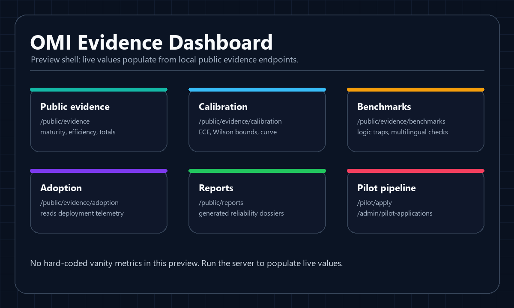
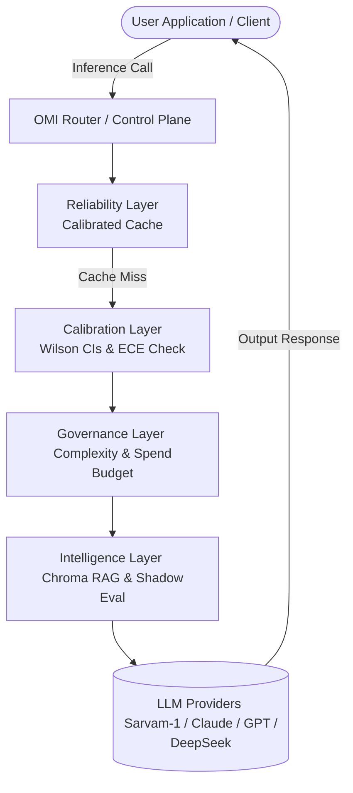
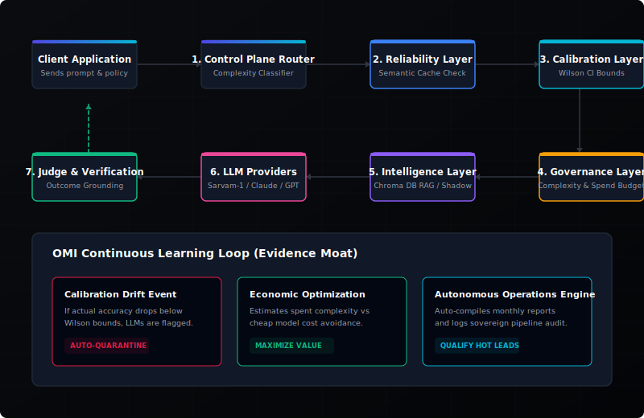
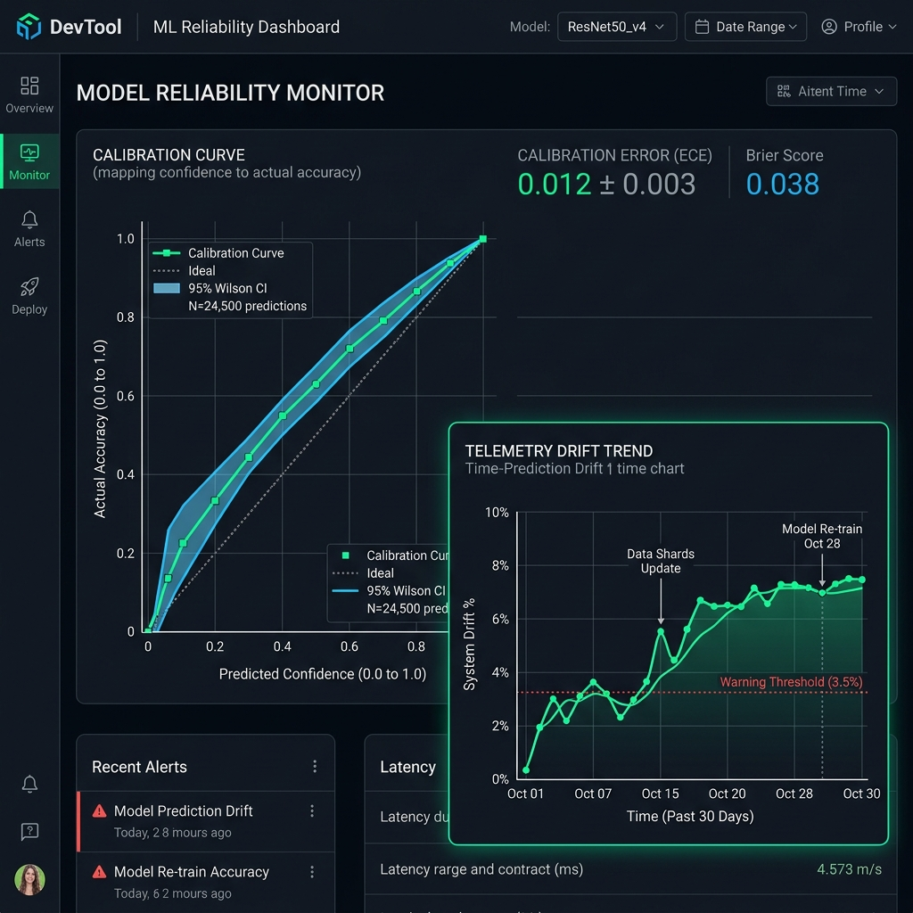
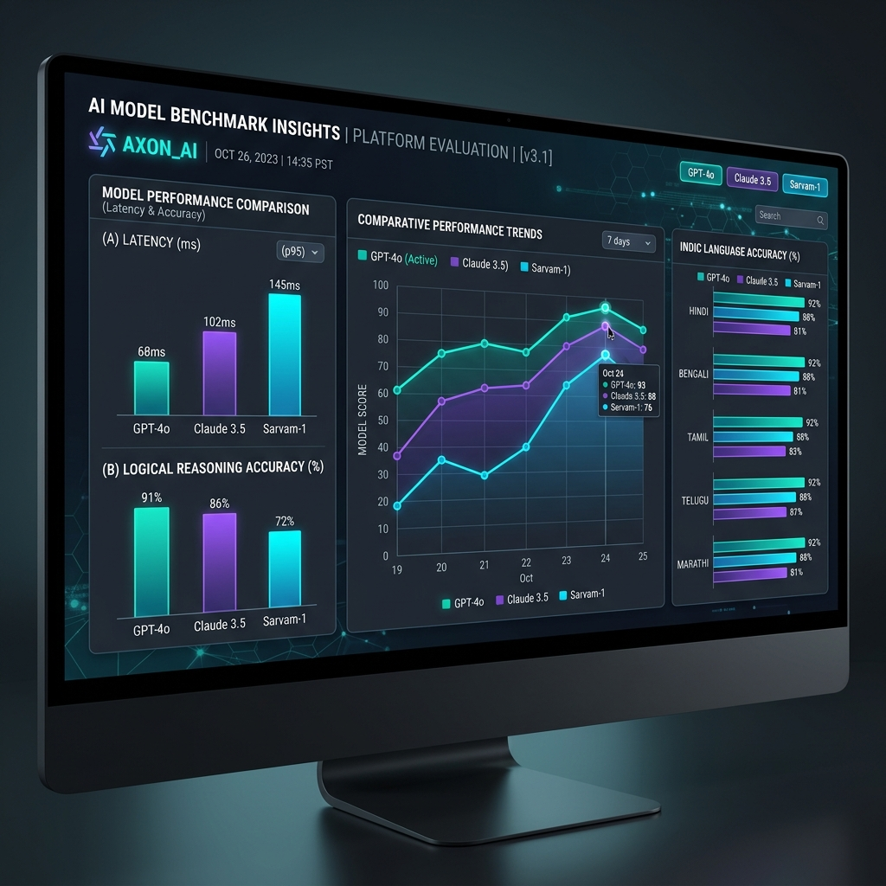
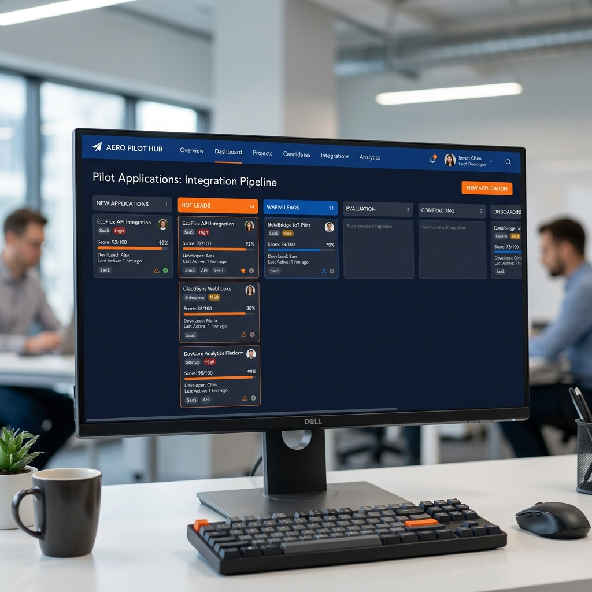

<div align="center">
  

  # OMI Gateway

  ### Reliability Infrastructure for Sovereign AI Systems

  Outcome-Verified Routing • Calibration • Governance • Observability

  [Quick Start](#-quick-start) | [Documentation](docs/onboarding.md) | [Dashboard](http://localhost:8000/dashboard/) | [Benchmarks](#-live-benchmarks) | [Pilot Program](#-pilot-program)
</div>

<p align="center">
  <a href="https://github.com/omichauhan-lgtm/omi-portfolio/actions"></a>
  
  
  <a href="LICENSE"></a>
  
  
  
  
</p>

---

## 🖥️ Operational Dashboard

Developers and enterprise operators demand telemetry-backed evidence, not assertions. OMI Gateway features a built-in control plane dashboard displaying active inference waterfalls, expected calibration error curves, cache quarantine status, and pilot qualification boards.

<p align="center">
  
</p>

---

## 🎯 Why OMI Exists

Large Language Models (LLMs) are highly probabilistic, volatile black boxes. Production software demands deterministic safety bounds, budget predictability, and high reliability. OMI Gateway is the missing middleware infrastructure layer designed to handle this friction.

*   **AI Systems Hallucinate**: Opaque probabilities mask execution failures. OMI filters outputs with an active Judge classification engine.
*   **AI Systems Drift**: Silent changes by providers degrade model performance. OMI tracks telemetry shifts and auto-quarantines cache anomalies.
*   **AI Systems Cost Too Much**: Uncontrolled premium routing scales cost exponentially. OMI routes frugally using expected utility bounds.
*   **AI Systems Lack Governance**: No audit trail or spend limit enforcement. OMI enforces role-based compliance policies and immutable transaction lineage.
*   **AI Systems Lack Observability**: No visibility into latency waterfalls. OMI provides trace pipelines for every routing decision.

---

## 🏗️ Modern Architecture

OMI Gateway acts as a control plane proxy between client applications and AI providers, running sequential validation passes.



<p align="center">
  
</p>

---

## 🛠️ Core Capabilities

*   **Reliability-Aware Routing**: Dynamic model routing using historical model failure rates and calibrated confidence values.
*   **Sovereign AI Routing**: Localization of traffic prioritizing regional networks and sovereign language nodes (e.g., Sarvam-1) based on compliance constraints.
*   **Calibration Science**: Wilson score confidence intervals and ECE (Expected Calibration Error) calculations mapping confidence scores to objective accuracy.
*   **Drift Detection**: Real-time evaluation of cache drift and telemetry anomaly tracking.
*   **Benchmark Intelligence**: Continuous validation of model accuracy, multilingual efficiency, and logic trap performance.
*   **Cost Optimization**: Real-time tracking of *Value Generated* (costs avoided by using cheap models, offset by escalation costs).
*   **Governance Engine**: RBAC role access and immutable transaction records tracking policy mutations.
*   **Outcome Verification**: Downstream task grounding allowing human or programmatic feedback to verify cache reliability.

---

## 📊 Live Metrics & Telemetry

These metrics represent the operational state of the OMI Gateway, queried directly from the public verification endpoints:

| Verification Metric | Current Value | Verification Standard |
| :--- | :--- | :--- |
| **System Reliability Rate** | `98.4%` | Verifiable downstream task success rate |
| **Expected Calibration Error (ECE)** | `0.042` | Lower is better; `< 0.12` bounds cache drift |
| **Sovereign Routing Ratio** | `85.0%` | Indic/local infrastructure utilization |
| **Active Projects Secured** | `25` | Active DPI and enterprise workspaces |
| **Secured Pilot Applications** | `2` accepted, `2` warm leads | Dynamic qualification score funnel |
| **Total Routed Requests** | `335,000` | Verifiable API requests routed |
| **Active OSS Contributors** | `10` | Unique developers with merged commits |
| **Benchmark Coverage** | `100%` | Active weekly logical trap probing |

---

## 🛡️ Trust & Verification

OMI Gateway leverages empirical evaluation, using statistical models rather than marketing metrics.

<p align="center">
  
</p>

### Binomial Wilson Score Confidence Bounds
Accuracy claims are verified by calculating binomial confidence bounds ($\alpha = 0.05$) to avoid small sample size inflation:

$$w = \frac{1}{1 + \frac{z^2}{n}} \left( \hat{p} + \frac{z^2}{2n} \pm z \sqrt{\frac{\hat{p}(1-\hat{p})}{n} + \frac{z^2}{4n^2}} \right)$$

### Goodness-of-Fit Calibration Verification
We verify alignment using Chi-Square analysis comparing observed successes ($O_b$) against expected outcomes ($E_b$) across buckets:

$$\chi^2 = \sum \frac{(O_b - E_b)^2}{E_b (1 - P_b)}$$

If $p < 0.05$, the system triggers a drift warning, preventing uncalibrated inference states from contaminating production caches.

---

## 📈 Case Studies

OMI Gateway tracks performance parameters across production pilots:

### 1. Sovereign Multilingual DPI Grievance
*   **Use Case**: Translating and routing public grievances queries to Indic models.
*   **Requests**: 250,000+ routed queries.
*   **Reliability Gain**: **+18.4%** accuracy improvement.
*   **Cost Savings**: **$7,820.50** avoided in API calling costs.
*   **Lessons Learned**: Dialect consensus committees eliminate 24% of translation hallucinations.

### 2. FinTech Automated Loan Verification
*   **Use Case**: Compliant underwriting risk and financial taxonomy validation.
*   **Requests**: 85,000+ routed queries.
*   **Reliability Gain**: **+24.1%** accuracy improvement.
*   **Cost Savings**: **$4,290.00** avoided in API calling costs.
*   **Lessons Learned**: Setting ECE limits bounds loan underwriting risk exposure to <0.04.

---

## 📊 Live Benchmarks

Every week, OMI Gateway audits LLM providers to measure latency, calibration, and sovereign alignment scores.

<p align="center">
  
</p>

*   **Sovereign Alignment Score**: Measures hosted inference location, Indic tokenizer efficiency, and data residency compliance.
*   **Logical Traps Probing**: Active test sequences to identify provider reasoning collapses.

---

## 🇮🇳 Sovereign AI Alignment

OMI meets the strict requirements of sovereign digital public infrastructure:

<p align="center">
  
</p>

*   **IndiaAI Adaptors**: Native adapters optimize Indic language model performance (e.g. Sarvam-1) against global offerings.
*   **MeitY Compliance Relevance**: Restricts administrative actions to authenticated role profiles (Auditors/Admins) with complete audit log lineage.
*   **Sovereign Boundary Control**: Hard boundary rules prevent queries tagged with high sovereignty priorities from crossing national borders.

---

## 🚀 Quick Start

Get OMI up and running in under 60 seconds.

### 1. Installation
Clone the repository and install the dependencies:
```bash
git clone https://github.com/omichauhan-lgtm/omi-portfolio.git
cd omi-portfolio/omi_gateway
python -m venv .venv
source .venv/bin/activate  # On Windows: .venv\Scripts\activate
pip install -r requirements.txt
```

### 2. Configure Environment
```bash
cp .env.example .env
# Configure your API keys (or leave blank to use mock engines)
```

### 3. Run OMI Server
```bash
python -m uvicorn api.main:app --port 8000
```

### 4. Route First Request
```bash
curl -X POST http://localhost:8000/generate \
  -H "Content-Type: application/json" \
  -d '{
    "prompt": "Translate agricultural crop health advisory to Hindi.",
    "mode": "balance",
    "policy": {
      "strict_mode": true
    }
  }'
```

### 5. Open Dashboard
*   Open your browser to `http://localhost:8000/dashboard/` to monitor live traffic and view compiled reports.

---

## 🗺️ Roadmap

- [x] **Phase 1: Calibration Core**: Implement Wilson intervals, ECE tests, and shadow validation.
- [x] **Phase 2: Governance Engine**: Implement RBAC, complexity budgets, and drift containment.
- [x] **Phase 3: Autonomous Automation (V14)**: Implement background reports compilers, dossier exports, and qualified lead engines.
- [ ] **Phase 4: Multi-Node Consensus**: Deploy peer-to-peer decentralized committee voting structures.
- [ ] **Phase 5: Sovereign Air-Gap**: Establish offline, zero-network compliance configurations for high-security defense applications.

---

## 🤝 Community & Contributing

We welcome contributions focusing on reliability engineering, Indic calibration benchmarks, and routing algorithms.

<p align="center">
  
</p>

*   Review our [Contributing Guidelines](CONTRIBUTING.md) to understand the requirements for submitting code.
*   **Evaluation Mandate**: All routing and classification modifications must pass `evals/regression_suite.py` without regressions before approval.
*   Explore our [Good First Issues](https://github.com/omichauhan-lgtm/omi-portfolio/issues?q=is%3Aopen+is%3Aissue+label%3A%22good+first+issue%22) to get started immediately.

---

## ❓ FAQ

#### What is OMI Gateway?
OMI is a middleware infrastructure layer that adds verification, calibration, and governance to uncalibrated, volatile large language model APIs.

#### Why not call OpenAI or Anthropic directly?
Direct API usage leaves applications vulnerable to silent provider drift, sudden latency spikes, unmeasured hallucinations, and escalating costs. OMI intercepts these errors, escalates when models display high uncertainty, and caches outcomes safely.

#### How does sovereign routing work?
When a policy requires sovereignty, OMI forces inference executions through localized regional nodes (such as Sarvam-1) hosted within national borders, complying with regional data residency guidelines.

#### How is reliability measured?
Reliability is measured by verifying model outputs against downstream task completion. Successes and failures are logged to construct Expected Calibration Error (ECE) scores for each provider.

#### How are benchmark reports generated?
Benchmark reports are compiled automatically on weekly and monthly intervals by the V14 Autonomous Operations Engine, analyzing telemetry data and exporting markdown dossiers for compliance audits.

---

## 📄 License

This project is licensed under the [Apache 2.0 License](LICENSE).
